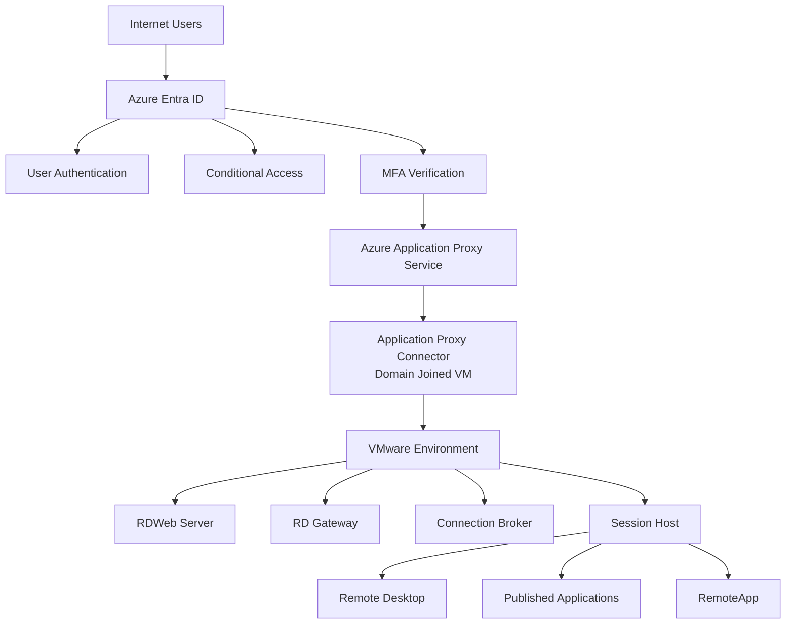

## Architecture Diagram

```mermaid
flowchart TD
    A[Internet Users] --> B[Azure Entra ID]
    B --> C[User Authentication]
    B --> D[Conditional Access]
    B --> E[MFA Verification]

    E --> F[Azure Application Proxy Service]

    F --> G[Application Proxy Connector<br/>Domain Joined VM]

    G --> H[VMware Environment]

    H --> I[RDWeb Server]
    H --> J[RD Gateway]
    H --> K[Connection Broker]
    H --> L[Session Host]

    L --> M[Remote Desktop]
    L --> N[Published Applications]
    L --> O[RemoteApp]
```
